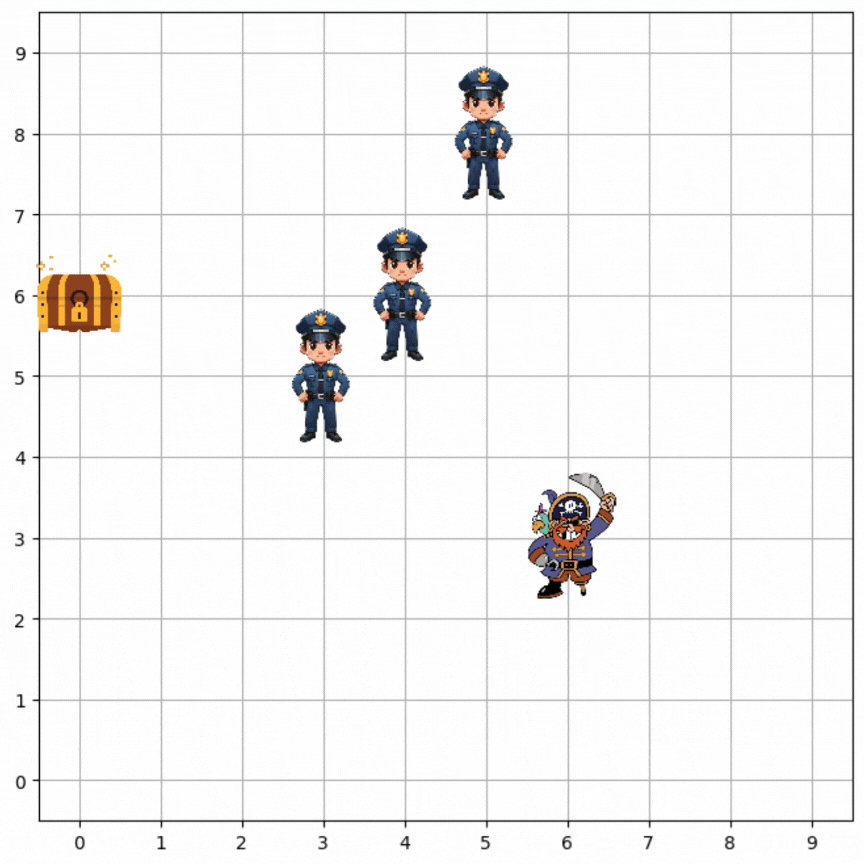

# Q_Learning_JM : Apprentissage par renforcement avec Q-Learning



## Table des matières
1. [Aperçu](#aperçu)
2. [Structure du code](#structure-du-code)
3. [Installation](#installation)
4. [Utilisation](#utilisation)
5. [Approche : Q-Learning avec Stable-Baselines3](#approche-q-learning-avec-stable-baselines3)
6. [Résultats](#résultats)

---

## Aperçu

Ce projet implémente un environnement de jeu personnalisé basé sur une grille 10x10, où un héros doit collecter un trésor tout en évitant des monstres. L'objectif est de former un agent à l'aide de Q-Learning (via la bibliothèque Stable-Baselines3) pour maximiser les récompenses en atteignant le trésor tout en minimisant les pénalités liées aux collisions avec les monstres.

Les monstres (ici policiers) ainsi que l'agent (ici le pirate) peuvent se déplacer de manière horizontales et verticales (ou encore rester immobile) mais les diagonales sont interdites car j'ai décidé d'utiliser la distance manhattan dans mon étude. De plus il est interdit pour les policiers de spawn sur une case voisine de l'agent ce qui metterait fin tout de suite à la partie...

### Fonctionnalités principales :
- **Environnement personnalisé** : Construit avec `gym` pour simuler les interactions entre le héros, le trésor et les monstres.
- **Agent Q-Learning** : Formé avec l'algorithme `DQN` (Deep Q-Network) de Stable-Baselines3.
- **Visualisation** : Rendu en temps réel de l'environnement pour les tests et la validation.

---

## Structure du code

Le projet est organisé comme suit :

```
Q_Learning_JM/
│
├── src/
│   ├── init.py 
│   ├── env.py # Environnement personnalisé Gym pour le jeu
│   ├── train.py # Script d'entraînement pour l'agent Q-Learning
│   ├── test.py # Script de test pour évaluer l'agent entraîné
│   ├── visualisation.py # Script de test pour visualiser le chemin de l'agent entrainé
│   ├── callbacks.py # Script pour le suivi des performances du modèle de Q-Learning
│   ├── assets/ # Goudies
│       ├── hero.png
│       ├── treasure.png
│       ├── monster.png
│       ├── gif_readme.gif
├── main.py 
├── requirements.txt
├── PDF_Recapitulatif.pdf
└── README.md 
```

---

## Installation 

### Prérequis
- Python 3.10 ou version ultérieure est recommandé pour une meilleure compatibilité.
- Un environnement virtuel est fortement conseillé pour éviter les conflits avec les packages système.

### Étapes
1. Clonez le dépôt :
   ```
   git clone https://github.com/matthieuschwa/Q_Learning_JM.git
   cd Q_Learning_JM
   ```
2. Créez et activez un environnement virtuel :
   ```
   python3 -m venv .env
   source .env/bin/activate
   ```
3. Installez les dépendances requises :
   ```
   pip install -r requirements.txt
   ```

--- 

## Utilisation

### Entrainer l'agent

Pour entraîner l'agent Q-Learning :
```
python main.py
```

Choisissez **"1"** pour démarrer l'entraînement. Le modèle entraîné sera sauvegardé dans Q_Pirate/models/hero_agent.
A la fin de l'entrainement apparaitra les graphiques liés aux performances de l'entrainement.

**Attention, un modèle entrainé existe déjà dans le projet. Cette option à été mise en place pour entrainer un modèle avec des paramètres différents. Il est inutile d'entrainer un même modèle 2 fois.**

### Tester l'agent sur un échantillon (100 scénarios)

Pour évaluer l'agent entraîné :
```
python main.py
```

Choisissez **"2"** pour tester l'agent et visualiser ses performances.

### Tester l'agent sur un scénario et visualiser son chemin

Pour visualiser le chemin de l'agent dans un scénario :
```
python main.py
```

Choisissez **"3"**.

---

## Approche : Q-Learning avec Stable-Baselines3

### Vue d'ensemble du Q-Learning

Le Q-Learning est une technique d'apprentissage par renforcement où un agent apprend à maximiser des récompenses cumulées en approximant la fonction **Q**. _Pour plus de détails sur le fonctionnement de cette technique je vous invite à consulter le PDF disponible dans ce repo._

### Détails de l'implémentation

#### Algorithme
Dans ce projet, nous utilisons l'algorithme **DQN (Deep Q-Network)** de la bibliothèque Stable-Baselines3. Cet algorithme combine le Q-Learning avec l'apprentissage profond pour approximer la fonction **Q**.

#### Modelage des récompenses
- **+30** : lorsque l'agent atteint le trésor.
- **-10** : lorsque l'agent entre en collision avec un monstre (case adjacente).
- **-5** : lorsque l'agent se trouve à moins de 2 cases d'un monstre.
- Récompenses positives/négatives lorsque l'agent s'approche/s'éloigne du trésor (récompenses intermédiaire)
- Faible malus si l'agent prend trop d'étapes avant de trouver le trésor (pour des questions pratiques).

#### Exploration
L'agent utilise une stratégie **epsilon-greedy** pour explorer efficacement l'environnement :
- **Fraction d'exploration** : `exploration_fraction`,
- **Probabilité minimale d'exploration** : `exploration_final_eps`.

#### Configuration d'entraînement
- Nombre total d'étapes d'entraînement : **200 000**.
- Politique utilisée : **Perceptron multicouche** (MLP, `MlpPolicy`).


--- 

## Résultats

En règle général, l'agent apprend avec succès à atteindre le trésor tout en évitant les monstres après ~200 000 étapes.

Cependant des scénarios spéciaux résistent encore à l'agent. Par exemple, si un monstre spawn au départ assez proche de l'agent, celui-ci peut être amené à mourir très vite. Ou encore une interception lorsque l'agent est encerclé, il tente d'échapper à chacun des monstres mais va de ce fait se rapprocher de l'un d'entre eux sans le vouloir. 


N'hésitez pas relancer le test si vous rencontrez un scénario de la sorte !


_Matthieu SCHWARTZ_


